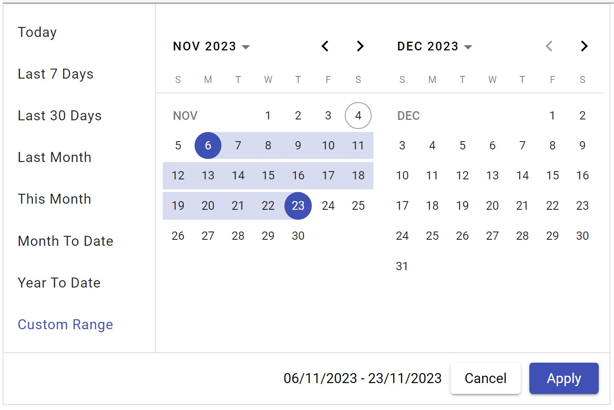

# ng-material-date-range-picker



## Description:

This library is build on top of angular material date-picker to provide date range selection with two views and predefined date options.

## Latest Version:
| Angular Version | Latest Library version |
| :-------------- | :-------------- |
| v16 | 1.2.15 |
| v17 | 2.3.0 |
| v18 | 3.0.0 |
| v19 | 4.0.1 |
| v19 | 5.0.0 |

## Getting Started with Ng Material Date Range Picker

The following section explains the steps required to create a simple 2 view Date Range Picker component and demonstrates its basic usage.

### Dependencies

To use the 2 view Date Range Picker component in your application, install the following dependency packages:

    1. angular (version 19.x)
    2. angular-material (version 19.x)

### Setup Angular Environment

Angular provides an easy way to set up Angular CLI projects using the Angular CLI tool.

1. Install the CLI application globally:
```bash
npm install -g @angular/cli
```

2. Create a new application:
```bash
ng new ng-date-range-picker-app
```

3. Navigate to the created project folder:
```bash
cd ng-date-range-picker-app
```

### Installing Dependencies
To use the 2 view Date Range Picker component in your application, install the following dependency packages:

1. **Angular Material Lib**:
```bash
npm i @angular/material@19
```

2. **Add bootstrap css inside angular.json (optional)**:
```bash
"styles": [
        "src/styles.css",
        "@angular/material/prebuilt-themes/indigo-pink.css"
      ],
```

### Installing Ng Date Range Picker Package
Range Picker package can be installed using the following command:

```bash
npm i ng-material-date-range-picker
```

### Registering Ng Material Date Range Picker Module

Import the 2 view Date Range Picker module into your Angular application (`src/app/app.module.ts`):

```typescript
import { NgModule } from '@angular/core';
import { CommonModule } from '@angular/common';
import { BrowserModule } from '@angular/platform-browser';
import { NgDatePickerModule } from 'ng-material-date-range-picker';
import { AppComponent } from './app.component';

@NgModule({
  declarations: [AppComponent],
  imports: [BrowserModule, NgDatePickerModule,  CommonModule],
  bootstrap: [AppComponent]
})
export class AppModule { }
```

### Adding Ng Date Range Picker Component

Modify the template in `src/app/app.component.ts` to render the 2 view Date Range Picker component:

```typescript
import { Component } from '@angular/core';
@Component({
  selector: 'app-root',
  template: `<ng-date-range-picker></ng-date-range-picker>`
})
export class AppComponent {
  title = 'ng-date-range-picker-test';
}
```

### Running the Application

After completing the required configuration, run the following command:

```bash
ng serve
```

This will display the Date Range Picker in your default browser.

## Features

- Allow to select date range with two views.
- Predefined date support with list items.
- User can modify predefined date list.
- Provides complete controls on predefined date action items.


## API Reference

#### Properties:

| Name | Type     | Description                |
| :-------- | :------- | :------------------------- |
| `selectedDates` | `DateRange<Date>` | **optional**. default selection of start and end date |
| `dateFormat` | `string`| **optional**. default is 'dd/MM/yyyy' |
| `dateDropDownOptions` | `ISelectDateOption[]`| **optional**. Addition options to predefined date action list. |
| `minDate` | `Date`| **optional**. To specify minimum date default is current date -10 years. |
| `maxDate` | `Date`| **optional**. To specify max date default is current date +10 years. |
| `selectedOptionIndex` | `number`| **optional**. To default selected option. (by default it is 3 which is last 30 days.) |
| `displaySelectedLabel` | `boolean`| **optional**. To show the selected option label instead of date range |
| `cdkConnectedOverlayPositions` | `ConnectedPosition[]`| **optional**. To control the overlay position |
| `staticOptionId` | `string`| **optional**. To set id of static options container |
| `dynamicOptionId` | `string`| **optional**. To set id of dynamic options container |

#### Events

| Name | Type     | Description                |
| :-------- | :------- | :------------------------- |
| `onDateSelectionChanged` | `DateRange<Date>` | Emits when date selection is changed. And it contains range: DateRange and selectedOption: ISelectDateOption |
| `dateListOptions` | `ISelectDateOption[]`| Emits pre-defined date action list items for configuration purpose. |

#### Example to configure predefined visibility of predefined date action list items:

```typescript
import { Component } from '@angular/core';
import { ISelectDateOption } from 'ng-date-range-picker/lib/model/select-date-option';

@Component({
  selector: 'app-root',
  template:` <ng-date-range-picker (dateListOptions)="dateListOptions($event)"></ng-date-range-picker>`
  templateUrl: './app.component.html',
  styleUrls: ['./app.component.scss'],
})
export class AppComponent {
  title = 'ng-date-range-picker-test';

  dateListOptions(optionList: ISelectDateOption[]) {
    optionList[0].isSelected = true;
    optionList[1].isVisible = false;
  }
}
```
In Above example first item of action list is selected and second option is hidden.

#### Note:
Upon clearing, it resets the minimum and maximum dates, and sets both the range and selectedOption to null.


## Demo's
[Demo 1](https://techtose-ng-date-range-picker.netlify.app/dashboards/analytics)

[Demo 2](https://techtose-ng-date-range-picker-materio.netlify.app)

## Playground

[Stackblitz](https://stackblitz.com/edit/ng-material-date-range-picker)
