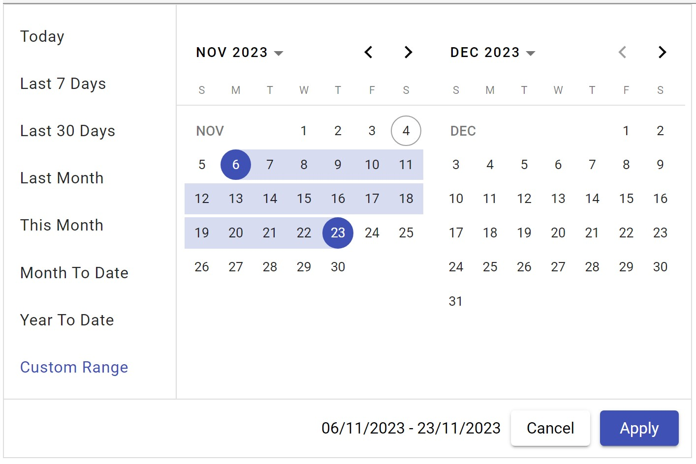

# ng-material-date-range-picker



## Description:

This library is build on top of angular material date-picker to provide date range selection with two views and predefined date options.

## Latest Version:
| Angular Version | Latest Library version |
| :-------------- | :-------------- |
| v16 | 1.2.15 |
| v17 | 2.3.0 |
| v18 | 3.0.0 |
| v19 | 4.0.1 |
| v20 | 5.0.0 |
| v21 | 6.2.0 |

## Getting Started with Ng Material Date Range Picker

The following section explains the steps required to create a simple 2 view Date Range Picker component and demonstrates its basic usage.

### Dependencies

To use the 2 view Date Range Picker component in your application, install the following dependency packages:

    1. angular (version 19.x)
    2. angular-material (version 19.x)

### Setup Angular Environment

Angular provides an easy way to set up Angular CLI projects using the Angular CLI tool.

1. Install the CLI application globally:
```bash
npm install -g @angular/cli
```

2. Create a new application:
```bash
ng new ng-date-range-picker-app
```

3. Navigate to the created project folder:
```bash
cd ng-date-range-picker-app
```

### Installing Dependencies
To use the 2 view Date Range Picker component in your application, install the following dependency packages:

1. **Angular Material Lib**:
```bash
npm i @angular/material@19
```

2. **Add bootstrap css inside angular.json (optional)**:
```bash
"styles": [
        "src/styles.css",
        "@angular/material/prebuilt-themes/indigo-pink.css"
      ],
```

### Installing Ng Date Range Picker Package
Range Picker package can be installed using the following command:

```bash
npm i ng-material-date-range-picker
```

### Registering Ng Material Date Range Picker Module

Import the 2 view Date Range Picker module into your Angular application (`src/app/app.module.ts`):

```typescript
import { NgModule } from '@angular/core';
import { CommonModule } from '@angular/common';
import { BrowserModule } from '@angular/platform-browser';
import { NgDatePickerModule } from 'ng-material-date-range-picker';
import { AppComponent } from './app.component';

@NgModule({
  declarations: [AppComponent],
  imports: [BrowserModule, NgDatePickerModule,  CommonModule],
  bootstrap: [AppComponent]
})
export class AppModule { }
```

### Adding Ng Date Range Picker Component

Modify the template in `src/app/app.component.ts` to render the 2 view Date Range Picker component:

```typescript
import { Component } from '@angular/core';
@Component({
  selector: 'app-root',
  template: `<ng-date-range-picker></ng-date-range-picker>`
})
export class AppComponent {
  title = 'ng-date-range-picker-test';
}
```

### Running the Application

After completing the required configuration, run the following command:

```bash
ng serve
```

This will display the Date Range Picker in your default browser.

## Features

- Allow to select date range with two views.
- Predefined date support with list items.
- User can modify predefined date list.
- Provides complete controls on predefined date action items.


## API Reference

#### Properties:

| Name | Type     | Description                |
| :-------- | :------- | :------------------------- |
| `selectedDates` | `DateRange<Date>` | **optional**. default selection of start and end date |
| `dateFormat` | `string`| **optional**. default is 'dd/MM/yyyy' |
| `dateDropDownOptions` | `ISelectDateOption[]`| **optional**. Addition options to predefined date action list. |
| `minDate` | `Date`| **optional**. To specify minimum date default is current date -10 years. |
| `maxDate` | `Date`| **optional**. To specify max date default is current date +10 years. |
| `selectedOptionIndex` | `number`| **optional**. To default selected option. (by default it is 3 which is last 30 days.) |
| `displaySelectedLabel` | `boolean`| **optional**. To show the selected option label instead of date range |
| `displaySelectedExpression` | `boolean`| **optional**. default `false`. To show the human-readable expressions (e.g. `now-7d - now`) in the main input instead of the date range. `displaySelectedLabel` takes priority when both are true. |
| `enableEditableDates` | `boolean`| **optional**. default `false`. When `true`, the custom-range footer shows two editable inputs (start/end) that accept a `dateFormat` date, an ISO 8601 duration (`p7d`), or date math (`now-7d`), with validation. See [Editable date inputs](#editable-date-inputs). |
| `cdkConnectedOverlayPositions` | `ConnectedPosition[]`| **optional**. To control the overlay position |
| `staticOptionId` | `string`| **optional**. To set id of static options container |
| `dynamicOptionId` | `string`| **optional**. To set id of dynamic options container |
| `allowSingleDateSelection` | `boolean`| **optional**. To allow or disable single date selection. Default is true |
| `autoSelectOption` | `boolean`| **optional**. When `true` and `selectedDates` is provided, automatically selects the matching preset option (e.g. "Last 7 Days"). Falls back to "Custom Range" if no option matches. Default is `false` |

#### Events

| Name | Type     | Description                |
| :-------- | :------- | :------------------------- |
| `onDateSelectionChanged` | `SelectedDateEvent` | Emits when date selection is changed. Contains `range: DateRange`, `selectedOption: ISelectDateOption`, and the human-readable `startExpr` / `endExpr` strings (e.g. `now-7d`, or absolute dates) — `null` on clear. |
| `dateListOptions` | `ISelectDateOption[]`| Emits pre-defined date action list items for configuration purpose. |

#### Example to configure predefined visibility of predefined date action list items:

```typescript
import { Component } from '@angular/core';
import { ISelectDateOption } from 'ng-date-range-picker/lib/model/select-date-option';

@Component({
  selector: 'app-root',
  template:` <ng-date-range-picker (dateListOptions)="dateListOptions($event)"></ng-date-range-picker>`
  templateUrl: './app.component.html',
  styleUrls: ['./app.component.scss'],
})
export class AppComponent {
  title = 'ng-date-range-picker-test';

  dateListOptions(optionList: ISelectDateOption[]) {
    optionList[0].isSelected = true;
    optionList[1].isVisible = false;
  }
}
```
In Above example first item of action list is selected and second option is hidden.

#### Note:
Upon clearing, it resets the minimum and maximum dates, and sets both the range and selectedOption to null.

## Parsing human-readable dates

The library exports a small, dependency-free `parseHumanDate` helper that turns
human-readable expressions into a `Date`. It tries, in order:

1. **Date math** (Grafana/Elasticsearch style): `now`, `now-7d`, `now-1M+15d`
   (units: `y M w d h m s`, where `M` = month and `m` = minute).
2. **ISO 8601 duration**: `P7D`, `PT1H30M`. Input is upper-cased first, so
   lowercase (`p7d`) is also accepted. A bare duration resolves relative to the
   base date — by default into the past (`durationSign: -1`), e.g. `p7d` → 7 days ago.
3. **Natural language** (`3 weeks ago`) — only if you register a parser (see below).

```typescript
import { parseHumanDate } from 'ng-material-date-range-picker';

parseHumanDate('now-7d');     // → Date, 7 days before now
parseHumanDate('p7d');        // → Date, 7 days ago (lowercase ISO accepted)
parseHumanDate('PT12H', { durationSign: 1 }); // → Date, 12 hours into the future
```

### Optional natural-language support

`chrono-node` is **not** a required dependency. To enable natural-language
parsing, install it in your app and register it once at startup:

```bash
npm i chrono-node
```

```typescript
import * as chrono from 'chrono-node';
import { setNaturalLanguageParser, parseHumanDate } from 'ng-material-date-range-picker';

setNaturalLanguageParser((text, ref) => chrono.parseDate(text, ref));

parseHumanDate('3 weeks ago'); // → Date
```

If no parser is registered, step 3 is simply skipped and `parseHumanDate`
returns `null` for input only natural language could understand.

### Editable date inputs

Set `enableEditableDates` to `true` to replace the read-only label in the
custom-range footer with two Material inputs:

```html
<ng-date-range-picker [enableEditableDates]="true"></ng-date-range-picker>
```

- Each input accepts a date in `dateFormat` (e.g. `06/06/2026`), an ISO 8601
  duration (`p7d`), or date math (`now-7d`). Typing a value updates the
  calendars; **Apply** commits the range.
- Invalid input shows a Material error and disables **Apply** until both
  values parse and the start is not after the end.
- Day-diff options (Today, Last 7 Days, …) pre-fill the inputs with their
  relative form (`now-7d` .. `now`); other ranges show absolute dates. To give
  a custom option an explicit relative form, set `startExpr` / `endExpr` on the
  `ISelectDateOption`.

## Styling

The project prefixes custom classes with `ndp-`.


## Demo's
[Demo 1](https://techtose-ng-date-range-picker.netlify.app/dashboards/analytics)

[Demo 2](https://techtose-ng-date-range-picker-materio.netlify.app)

## Playground

[Stackblitz](https://stackblitz.com/edit/ng-material-date-range-picker)
